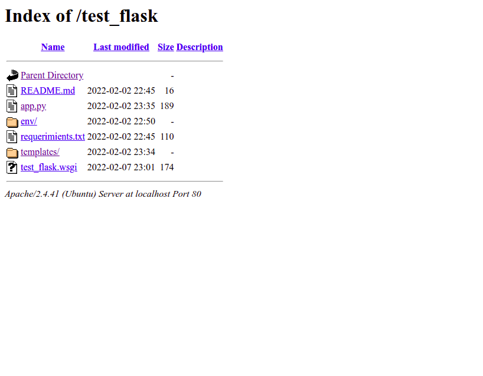

# proyecto de prueba para configuración de servidor apache

La configuración de flask y apache esta lista en un 90 porciento.

AL entrar a: localhost/test_flask, en el navegador se muestra una pantalla como la de la siguiente imagen.

